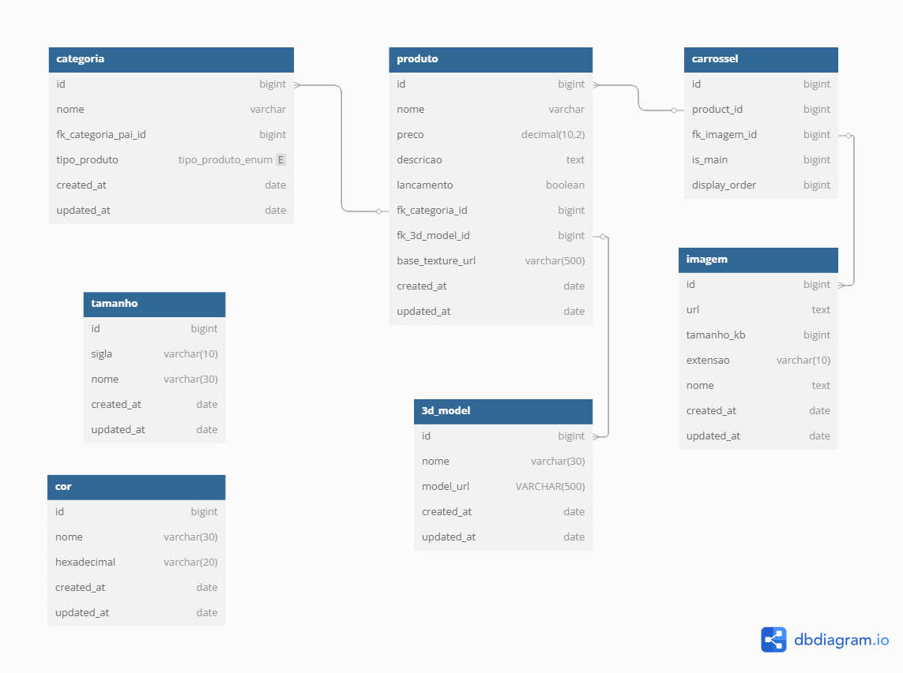

# no.wasTee

## Sobre
Esse projeto foca numa solução voltada para a empresa no.wasTee, mais especificamente na sua [loja online](https://nowastee.com/loja/produto/) de roupas.

[Website para referência](https://nowastee.com/loja/categoria-produto/t-shirts/casual/)

## Problemas
A equipe no.wasTee demonstrou necessidade em melhorar o processo de venda das suas camisetas e sugeriu duas melhorias:
1. Transparência no processo de criação da peça mostrando desde a aquisição da materia prima até o processo de fabricação e entrega ao cliente.
2. Visualização 3D dos modelos disponíveis para compra, assim como possibilitar que o cliente faça uploads de estampas para ter uma visão prévia do que vai comporar.

## Solução (Breve)

1. Para solucionar o problema da transparência da fabricação, cada produto terá uma página interativa mostrando o passo à passo do seu ciclo de vida. Além disso, cada produto terá uma etiqueta com o qrCode que, ao ser scanneado, redirecionará para essa página da web.
2. Para solucionar o problema dos modelos 3D, na página de compra dos produtos vamos adicionar um visualizador 3D do modelo em questão. Durante a visualização do modelo (tela cheia), o usuário terá a opção de subir arquivos *.png* ou *.jpg* para ser adicionado como estampa do produto no modelo 3D.

# 1. Processo de fabricação (TO DO)

# 2. Visualização 3D (TO DO)

## 2.1 Tecnologias
### Blender
Para manipular UV map dos modelos 3D, dessa forma será possível fazer com que a textura seja aplicada apenas em uma parte do modelo, no caso das camisetas costuma ser um retângulo na parte frontal.

### Next.js (frontend) e SpringBoot (backend)
Assim será possível hostear um website que acessa dados reais. O website não será funcional, mas sim um protótipo.

## 2.2 Diagrama ERM

